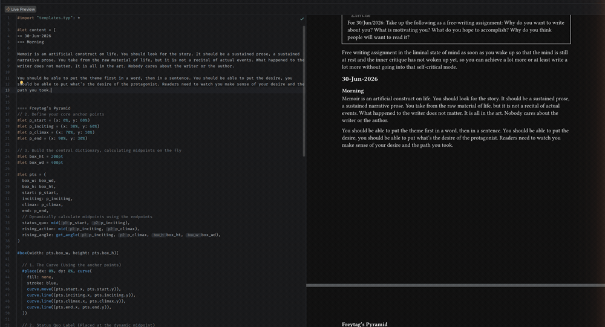
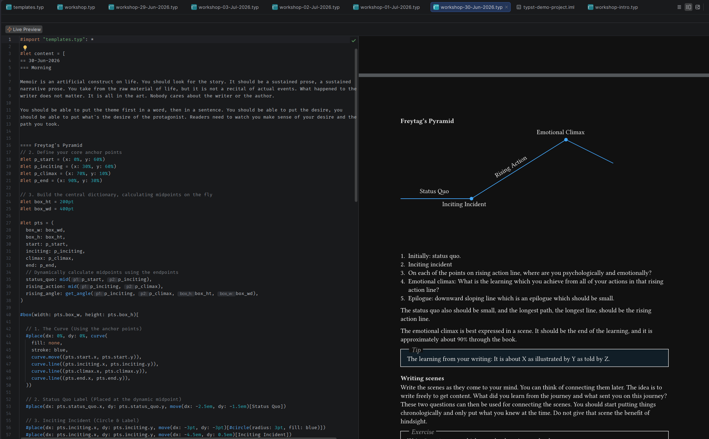
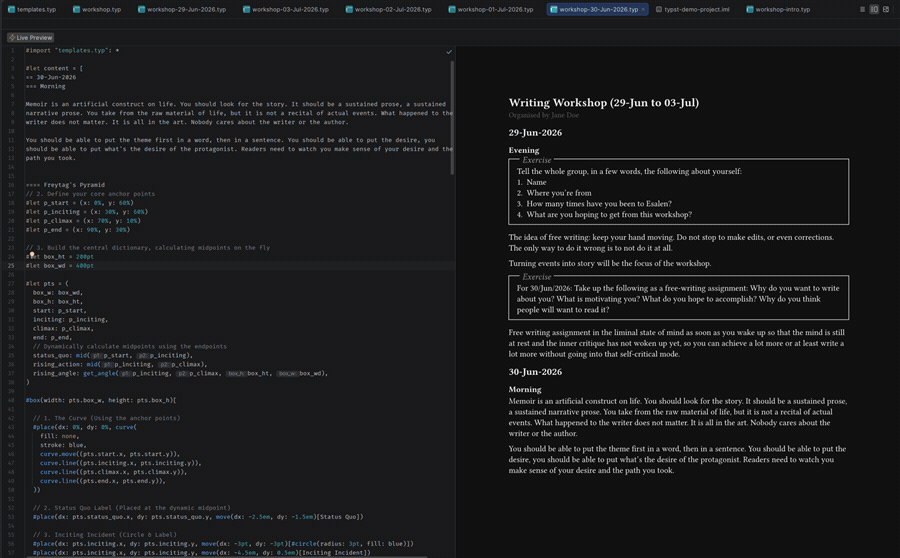
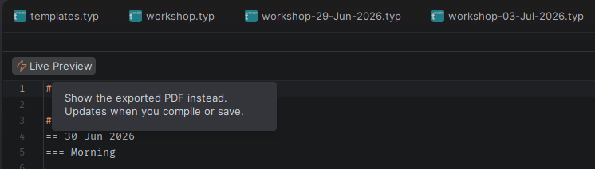
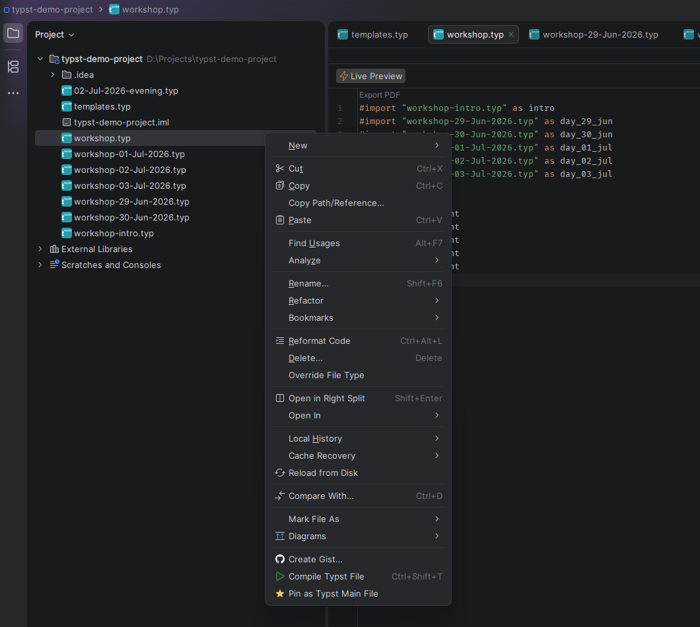

# Typst Renderer — IntelliJ Plugin

> **IntelliJ Platform Plugin · v0.4.1**

<!-- Plugin description -->
Full Typst support for IntelliJ-based IDEs — syntax highlighting, live PDF preview, LSP-powered completions and
diagnostics, zero-config setup.

## Features

All features work out of the box — no manual installation of binaries required.

### 📄 Preview, live or as PDF

A split editor panel shows your document alongside the source, rendered one of two ways and chosen with the
**Live / PDF** button in the preview toolbar:

- **Live** (default) — rendered by tinymist as you type. Edits appear within milliseconds, with no save and no PDF
  written to disk. The preview follows your cursor, and clicking it jumps the editor to the matching source.
- **PDF** — the exported PDF itself, shown in the built-in viewer. Updates when you save, **Compile** or **Export**,
  preserving scroll position within a session and, optionally, across IDE restarts.

Each editor tab keeps its own setting, so one file can be live while another shows its PDF. **Compile** and **Export**
never change which renderer a tab is using.

### 📌 Pin a main entry file

In a project where `main.typ` `#include`s a tree of chapters, opening a chapter on its own compiles it in isolation —
so every cross-file reference reports "label does not exist". Right-click a file and choose **Pin as Typst Main File**
and the whole project compiles through that entry instead: cross-references resolve, the phantom errors go, and the
preview shows the complete document while you edit any chapter. Editors that resolve to the same pinned main share a
single live preview rather than each running their own.

### ⚡ Full LSP Integration

Powered by [tinymist](https://github.com/Myriad-Dreamin/tinymist) — the most complete Typst language server. Includes:
code completion, diagnostics, hover docs, go-to-definition, formatting, and rename refactoring.

### 🎨 Syntax Highlighting
Full colour syntax highlighting for `.typ` files — keywords, functions, strings, comments, and more.

### ⌨️ Compile Action

Single-shot compile with `Ctrl+Shift+T`. Uses tinymist's `exportPdf` command — no separate Typst CLI required. Errors
route directly to the **Typst Output** console with clickable file links.

### 💬 Comment Toggling
Toggle line and block comments in `.typ` files with the standard shortcuts: `Ctrl+/` and `Ctrl+Shift+/`.

### 📋 Typst Output Console

Dedicated tool window showing compilation output. Errors are displayed with clickable links that jump to the offending
line.

### 📁 Project Root Resolver

Automatically determines the Typst project root via a priority chain: explicit project override → auto-detection from
file location.

### 📥 Auto-download tinymist
On first use, the plugin auto-downloads **tinymist** from GitHub for your platform. No Cargo or Homebrew needed.

---

## Live Preview

Edit and preview side by side, with the preview keeping up as you type — no save, no compile step.

### Choosing the renderer

The **Live / PDF** button at the top-left of the preview toolbar switches the pane between the two renderers, per
editor tab. *Default preview mode* in settings decides what a newly opened tab starts with; **Live** is the default.
The same action is available from the editor's right-click menu and from *Find Action*, so it can be given a keyboard
shortcut.

If a live preview cannot start — an old tinymist, a refused port — the pane falls back to the PDF renderer by itself
and explains why in the **Typst Output** console.

### Worth knowing

- **In Live mode, saving no longer writes a PDF.** The live renderer draws without producing a file, so the PDF on
  disk is written only when you ask for one with **Compile** (<kbd>Ctrl+Shift+T</kbd>) or **Export**. If you have a
  build script watching the export directory, or an external viewer open on the file, switch the pane to **PDF** or set
  *Default preview mode* to *PDF*.
- **A compile error leaves the live pane showing the last good version.** A document that has never compiled shows an
  empty pane rather than an error page. The errors are still reported in the editor gutter and the **Typst Output**
  console. PDF mode shows an error page instead, if you prefer that.
- **Clicking the preview jumps to the source.** If the target file is already open in front of you, the line is
  highlighted but the cursor and keyboard focus stay in the preview — click into the editor to carry on typing.
  Jumping to a file that is not already open places the cursor and moves focus normally.
- **Editors showing the same document share one preview.** With a main file pinned, every open chapter renders through
  a single preview rather than one each, so they also scroll together.

---

## Language Intelligence

Full LSP support via tinymist — auto-downloaded and wired up, no extra steps needed.

### ✨ Code Completion

Context-aware completions for Typst functions, variables, labels, import paths, and built-in symbols. Trigger with
`Ctrl+Space`.

### ⚠️ Real-time Diagnostics

Errors and warnings appear as inline squiggles as you type. Undefined labels, type mismatches, and syntax errors surface
instantly.

### 📖 Hover Documentation
Hover over any function or variable to see inline documentation directly in the editor.

### 🔍 Go-to-definition
Jump to the definition of labels, variables, and imported functions across files with `Ctrl+Click` or `F12`.

### ✏️ Rename Refactoring
Rename labels, variables, and references across the project with `Shift+F6`. All usages update automatically.

### 🎯 Formatting
Format your Typst documents with the standard IDE reformat action, powered by tinymist's built-in formatter.

---

## Typst Output Console

All compilation errors and warnings route to the dedicated **Typst Output** console. Errors are clickable and jump to
the offending line.

---

## Settings & Project Overrides

Access via **Settings → Tools → Typst Renderer**.

### Global Settings

| Setting                        | Description                                                                                                               |
|--------------------------------|---------------------------------------------------------------------------------------------------------------------------|
| **Language Server (Tinymist)** | Status shows detected path. Leave blank to auto-detect. Click *Download Tinymist* to fetch the latest binary from GitHub. |
| **Default preview mode**       | Which renderer a newly opened preview starts in — **Live** or **PDF**. Each editor tab can be switched with the toggle in its preview toolbar. |
| **Update live preview on every keystroke** | On by default. Turn off to have the live preview refresh on save instead — worth it only for very large documents, where continuous recompilation costs more than the immediacy. No effect in PDF mode. |
| **Scroll the live preview to follow the cursor** | On by default. Keeps the preview on the passage you are editing. Editors sharing one preview scroll together. No effect in PDF mode. |
| **Remember scroll position**   | Restores the PDF preview scroll position when re-opening a `.typ` file after an IDE restart.                              |

### Per-Project Overrides

Access via **Settings → Tools → Typst Renderer → Project Overrides**. Useful when working with monorepos or projects
with non-default layout.

| Setting                | Description                                                                                                                     |
|------------------------|---------------------------------------------------------------------------------------------------------------------------------|
| **Typst project root** | Directory used as the project root for tinymist and as the base for compilation. Leave blank to auto-detect from file location. |
| **Export directory**   | Directory where compiled PDFs are written (default: `target`). Relative paths are resolved from the project root.               |
| **Font path**          | Directory containing extra fonts to make available to the Typst compiler and LSP. Leave blank to use system fonts only.         |

---

## Installation

No external tools required. The plugin handles everything on first launch.

### Via Marketplace (recommended)

1. Open **Settings / Preferences → Plugins → Marketplace**
2. Search for **"typst-renderer"**
3. Click **Install** and restart the IDE
4. Open any `.typ` file — tinymist will be auto-downloaded on first use

### Requirements

- **IntelliJ-based IDE** — Compatible with IntelliJ IDEA, Android Studio, CLion, GoLand, PyCharm, Rider, RustRover,
  WebStorm, and eight more.
- **IDE version — 2026.1 only (build `261.x`).** This release is **not yet compatible with 2026.2**: the platform's
  bundled LSP API changed in a binary-incompatible way, so the plugin is pinned to the 2026.1 line for now. 2026.2
  support is tracked in [issue #74](https://github.com/pndv/typst-renderer/issues/74).
- **Internet connection** — Required on first launch to download tinymist from GitHub. Subsequent launches work fully
  offline.
- **Custom tinymist path** — Already have tinymist installed? It will be detected automatically, or you can set a custom
  path in Settings.
<!-- Plugin description end -->

---

## See it in action

#### Live preview — the document re-renders as you type, with no save and no PDF written*



*Still, if the animation above does not play:*



#### The Live / PDF button — switch renderer per editor tab, without leaving the pane*



*Still, if the animation above does not play:*



#### Pin a main entry file — every chapter compiles through the whole document*



#### PDF preview — the exported PDF itself, updated on compile, scroll position preserved*


#### LSP completions and hover documentation powered by tinymist*


#### Typst Output console — errors are clickable and jump to the offending line*


#### Settings → Tools → Typst Renderer — global and per-project configuration*


---

## Troubleshooting — Enabling Debug Logs

If something isn't working as expected, enable debug-level logging.

**Step 1 — Open Debug Log Settings**

Navigate to **Help → Diagnostic Tools → Debug Log Settings…**

**Step 2 — Add the package names**

Paste the following into the input field, one per line:

```
com.github.pndv.typstrenderer
com.github.pndv.typstrenderer.compile
com.github.pndv.typstrenderer.toolWindow
com.github.pndv.typstrenderer.editor
```

You can also use a wildcard: `com.github.pndv.typstrenderer:all`

**Step 3 — Reproduce and collect logs**

Click OK, reproduce the issue, then go to **Help → Show Log in Explorer** to locate `idea.log`. Include it when filing
a [bug report](mailto:babbupandey@gmail.com).

---

## Links

- [JetBrains Marketplace](https://plugins.jetbrains.com/plugin/31308-typst-renderer)
- [Releases](https://github.com/pndv/typst-renderer/releases)
- [License (Apache 2.0)](https://www.apache.org/licenses/LICENSE-2.0)
- [Report an Issue](mailto:babbupandey@gmail.com)
