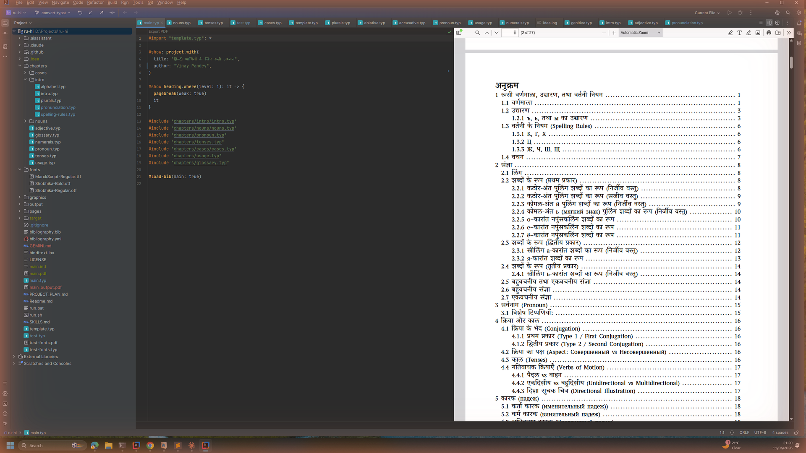
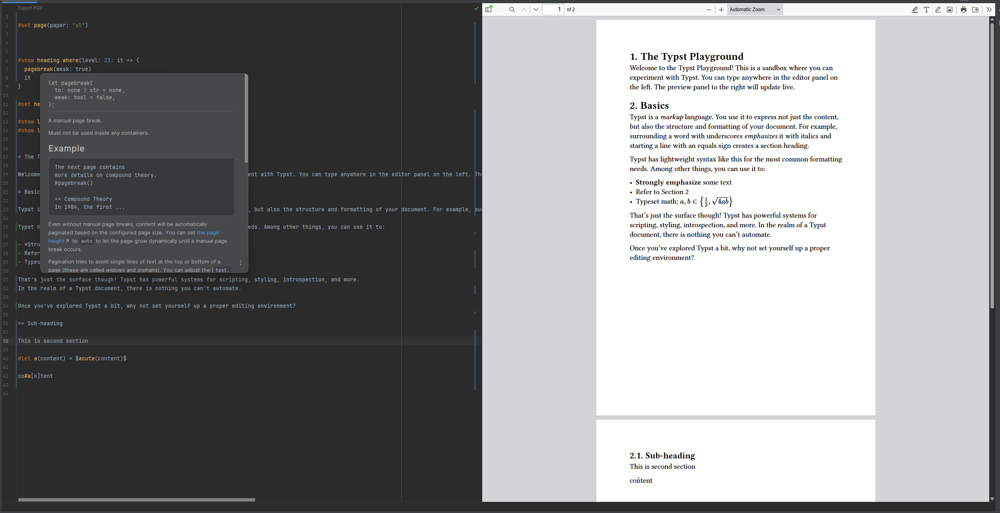
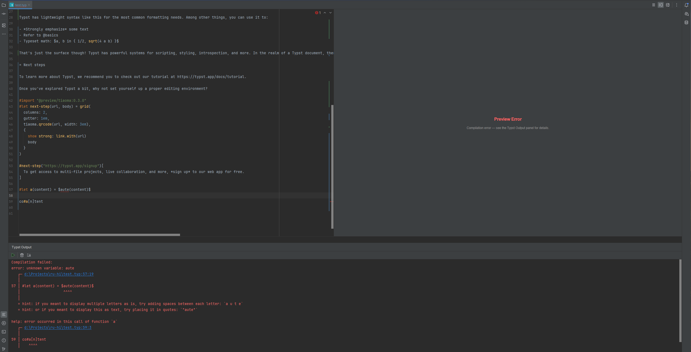
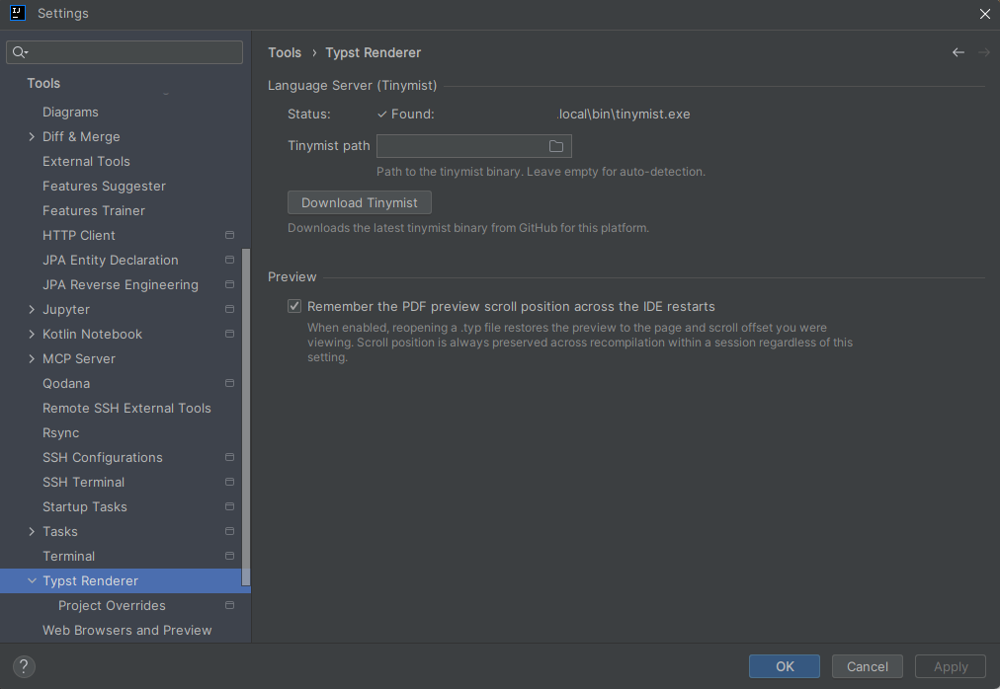
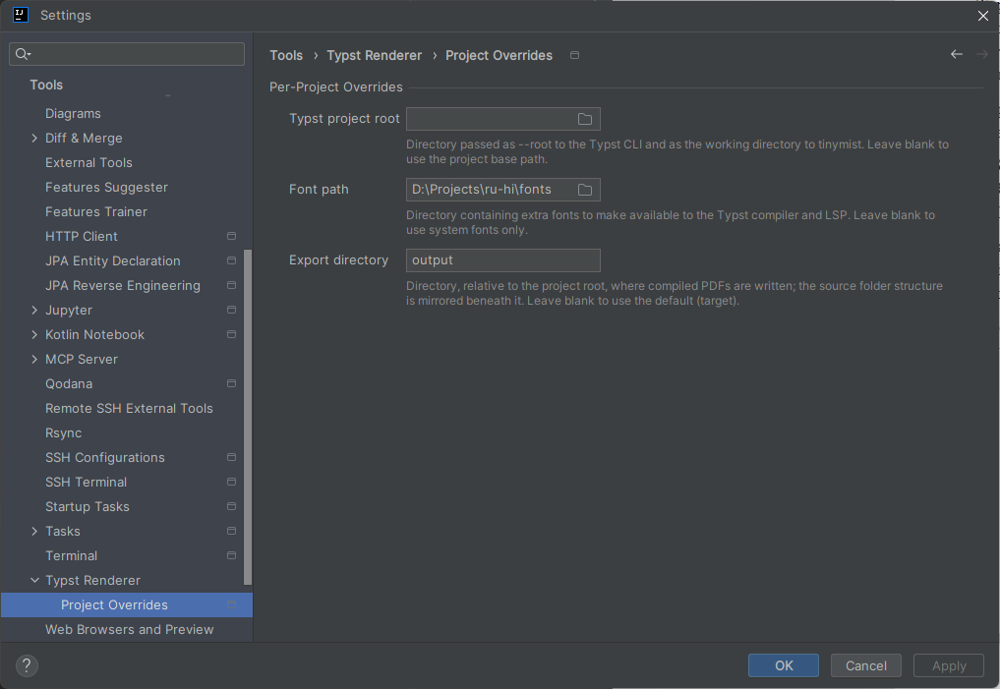

# Typst Renderer — IntelliJ Plugin

> **IntelliJ Platform Plugin · v0.4.0**

<!-- Plugin description -->
Full Typst support for IntelliJ-based IDEs — syntax highlighting, live PDF preview, LSP-powered completions and
diagnostics, zero-config setup.

[↓ Install from Marketplace](https://plugins.jetbrains.com/plugin/31308-typst-renderer) · [View on GitHub](https://github.com/pndv/typst-renderer)

| 16 Compatible IDEs | Zero Config required | LSP via tinymist | Hot-swap PDF Preview |
|--------------------|----------------------|------------------|----------------------|

---

## See it in action



*Live PDF preview — compiled PDF updates on every save, scroll position preserved*



*LSP completions and hover documentation powered by tinymist*

---

## Features

All features work out of the box — no manual installation of binaries required.

### 📄 Live PDF Preview

A split editor panel shows the compiled PDF alongside your source. The PDF updates in place on every save, preserving
the scroll position within a session. Scroll position is also restored across IDE restarts when the option is enabled in
settings.

### ⚡ Full LSP Integration

Powered by [tinymist](https://github.com/Myriad-Dreamin/tinymist) — the most complete Typst language server.
Includes:
code completion , diagnostics, hover docs, go-to-definition, formatting, and rename refactoring.

### 🎨 Syntax Highlighting

Full colour syntax highlighting for `.typ` files — keywords, functions, strings, comments, and more.

### ⌨️ Compile Action

Single-shot compile with `Ctrl+Shift+T`. Uses tinymist's `exportPdf` command — no separate Typst CLI required. Errors
route directly to the **Typst Output** console with clickable file links.

### 💬 Comment Toggling

Toggle line and block comments in `.typ` files with the standard shortcuts: `Ctrl+/` and `Ctrl+Shift+/`.

### 📋 Typst Output Console

Dedicated tool window showing compilation output. Errors are displayed with clickable links that jump to the offending
line.

### 📁 Project Root Resolver

Automatically determines the Typst project root via a priority chain: explicit project override → auto-detection from
file location.

### 📥 Auto-download tinymist

On first use, the plugin auto-downloads **tinymist** from GitHub for your platform. No Cargo or Homebrew needed.

---

## Live Preview

Edit and preview side by side. The split editor updates automatically on every save — no manual compilation is needed.


---

## Language Intelligence

Full LSP support via tinymist — auto-downloaded and wired up, no extra steps needed.

### ✨ Code Completion

Context-aware completions for Typst functions, variables, labels, import paths, and built-in symbols. Trigger with
`Ctrl+Space`.

### ⚠️ Real-time Diagnostics

Errors and warnings appear as inline squiggles as you type. Undefined labels, type mismatches, and syntax errors surface
instantly.

### 📖 Hover Documentation

Hover over any function or variable to see inline documentation directly in the editor.

### 🔍 Go-to-definition

Jump to the definition of labels, variables, and imported functions across files with `Ctrl+Click` or `F12`.

### ✏️ Rename Refactoring

Rename labels, variables, and references across the project with `Shift+F6`. All usages update automatically.

### 🎯 Formatting

Format your Typst documents with the standard IDE reformat action, powered by tinymist's built-in formatter.


---

## Typst Output Console

All compilation errors and warnings route to the dedicated **Typst Output** console. Errors are clickable and jump to
the offending line.



---

## Settings & Project Overrides

### Global Settings

Access via **Settings → Tools → Typst Renderer**.


| Setting                        | Description                                                                                                               |
|--------------------------------|---------------------------------------------------------------------------------------------------------------------------|
| **Language Server (Tinymist)** | Status shows detected path. Leave blank to auto-detect. Click *Download Tinymist* to fetch the latest binary from GitHub. |
| **Remember scroll position**   | Restores the PDF preview scroll position when re-opening a `.typ` file after an IDE restart.                              |

### Per-Project Overrides

Access via **Settings → Tools → Typst Renderer → Project Overrides**. Useful when working with monorepos or projects
with non-default layout.


| Setting | Description |
|------------------------|---------------------------------------------------------------------------------------------------------------------------------|
| **Typst project root** | Directory used as the project root for tinymist and as the base for compilation. Leave blank
to auto-detect from file location. |
| **Export directory**   | Directory where compiled PDFs are written (default: `target`). Relative paths are resolved
from the project root. |
| **Font path**          | Directory containing extra fonts to make available to the Typst compiler and LSP. Leave blank
to use system fonts only. |

---

## Installation

No external tools required. The plugin handles everything on first launch.

### Via Marketplace (recommended)

1. Open **Settings / Preferences → Plugins → Marketplace**
2. Search for **"typst-renderer"**
3. Click **Install** and restart the IDE
4. Open any `.typ` file — tinymist will be auto-downloaded on first use

### Requirements

- **IntelliJ-based IDE** — Compatible with IntelliJ IDEA, Android Studio, CLion, GoLand, PyCharm, Rider, RustRover,
  WebStorm, and eight more.
- **Internet connection** — Required on first launch to download tinymist from GitHub. Subsequent launches work fully
  offline.
- **Custom tinymist path** — Already have tinymist installed? It will be detected automatically, or you can set a custom
  path in Settings.

<!-- Plugin description end -->

---

## Troubleshooting — Enabling Debug Logs

If something isn't working as expected, enable debug-level logging.

**Step 1 — Open Debug Log Settings**

Navigate to **Help → Diagnostic Tools → Debug Log Settings…**

**Step 2 — Add the package names**

Paste the following into the input field, one per line:

```
com.github.pndv.typstrenderer
com.github.pndv.typstrenderer.compile
com.github.pndv.typstrenderer.toolWindow
com.github.pndv.typstrenderer.editor
```

You can also use a wildcard: `com.github.pndv.typstrenderer:all`

**Step 3 — Reproduce and collect logs**

Click OK, reproduce the issue, then go to **Help → Show Log in Explorer** to locate `idea.log`. Include it when filing
a [bug report](https://github.com/pndv/typst-renderer/issues/new).

---

## Links

- [JetBrains Marketplace](https://plugins.jetbrains.com/plugin/31308-typst-renderer)
- [GitHub](https://github.com/pndv/typst-renderer)
- [Changelog](https://github.com/pndv/typst-renderer/releases)
- [License (Apache 2.0)](https://www.apache.org/licenses/LICENSE-2.0)
- [Report an Issue](https://github.com/pndv/typst-renderer/issues/new)

